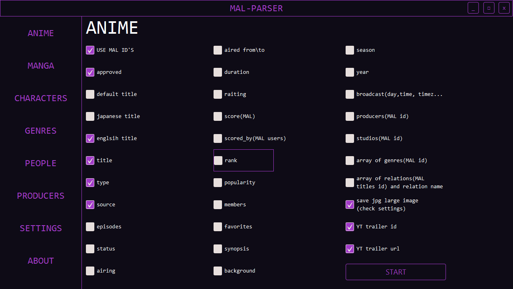

# MAL PARSER(BETA)
Application for parsing MyAnimeList using Jikan API, convert received json to sql table.
Now I'm making a GUI user interface with JavaFX.
### Released features:

* Receive JSON files with your parameter(console and file editing).
* Download and save pictures.
* GUI interface(not connected to main code).

### Technologies used:

* Java, JSON, JavaFX.
* MAVEN, MySQL.

### Screenshots:
###### GUI interface
